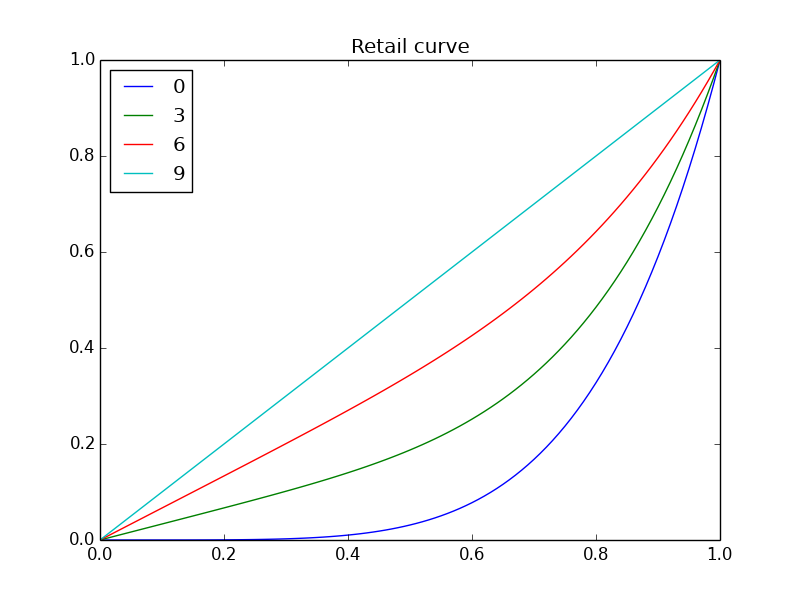
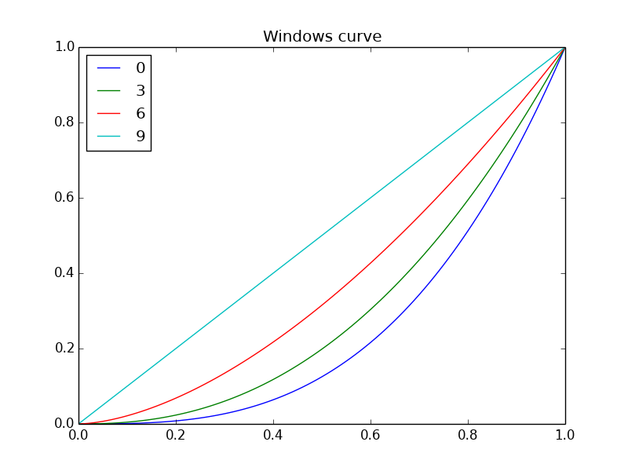
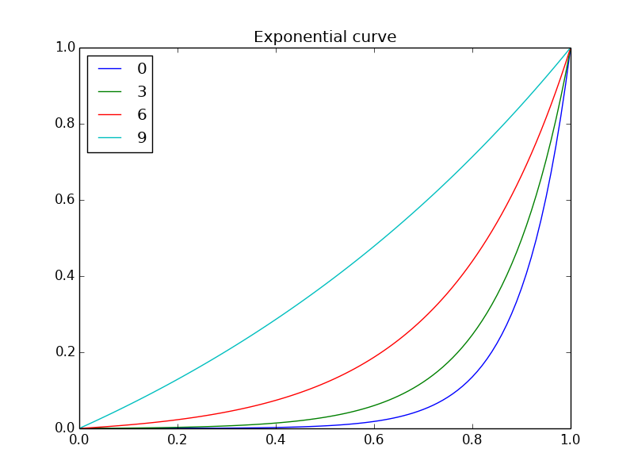
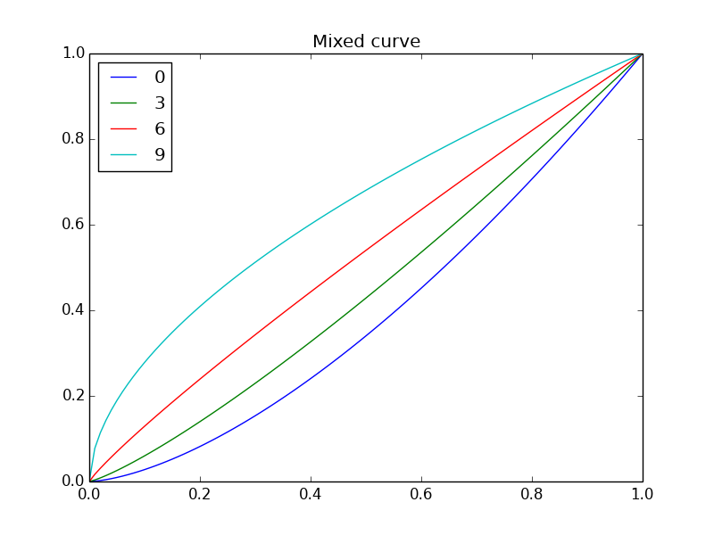
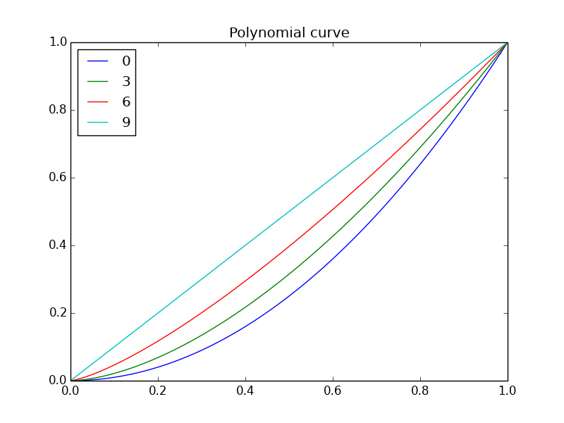

Existing curves
===============
### Retail curve
`-joystick_curves 0`

The joystick curve found in the retail game's source.

    f(I) = I*(s/9)+(I^5)*(9-s)/9

### Current curve for Windows version
`-joystick_curves 1`

The Windows version of `joy.cpp` got a new curve at some point.

    f(I) = I^(3-(s/4.5))

Suggestions for new curves
===========================
The following curves will be added for testing.

### Herra's suggestion
`-joystick_curves 2`

Adapted from http://www.hard-light.net/forums/index.php?topic=67633.msg1336430#msg1336430

    f(I) = I^(s/9)*((1-cos(I*π))/2)^((9-s)/9)

")

Alternatively, a wider range of curves can be achieved by a small change in the last exponent. 

`-joystick_curves 3`

    f(I) = I^(s/9)*((1-cos(I*π))/2)^((9-s)/4.5)

")

### Exponential curve
`-joystick_curves 4`

    f(I) = (exp(I)-1)/(exp(1)-1)

NB: Ignores sensitivity setting.

### Mixed power curve
`-joystick_curves 5`

*Yet another Herra suggestion.*

Starts with a positive power shape at `s<5`, becomes linear at `s=5`, then takes a fractional power shape at `s>5`.

    f(x) = I^(1+((5-s)/9))

NB: The linear point (5) might be changed.

### Power curve
`-joystick_curves 6`

    f(I) = I*I^((9-s)/9)

NB: **Redundant**. The entire behaviour of this curve can be achieved with a subset of sensitivity settings `s` on the current Windows curve.

### Debug
`-joystick_curve 7`

This curve just returns `f(I) = 0.3` for debugging purposes.

List of symbols
===============

    I    : input percent (position of joystick on half-axis).
    s    : in-game sensitivity setting [0..9].
    f(I) : translation of input percent to output (the result of the curve function).
